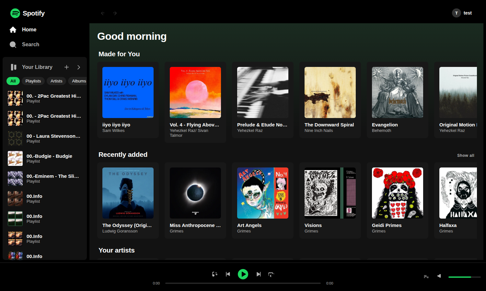
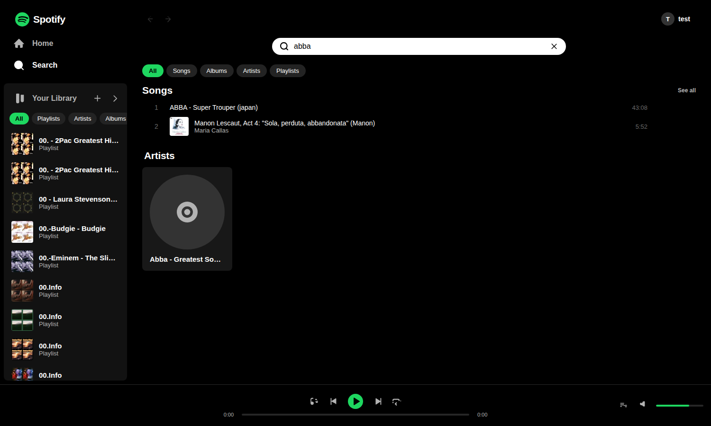
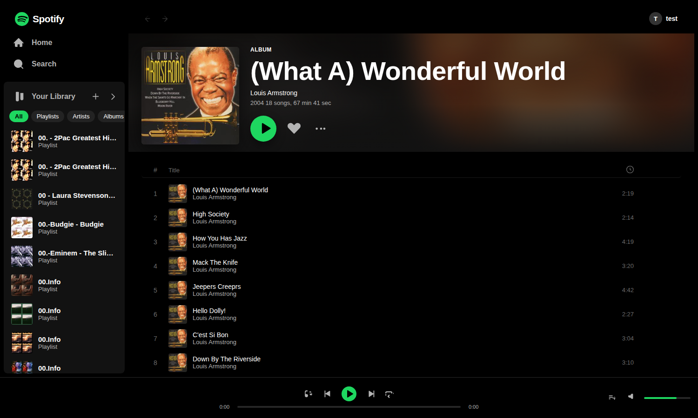
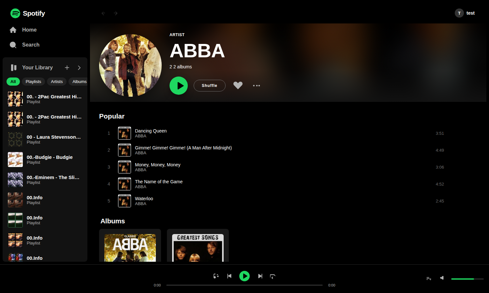
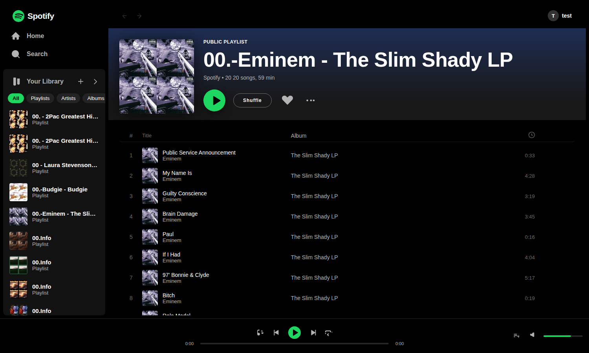
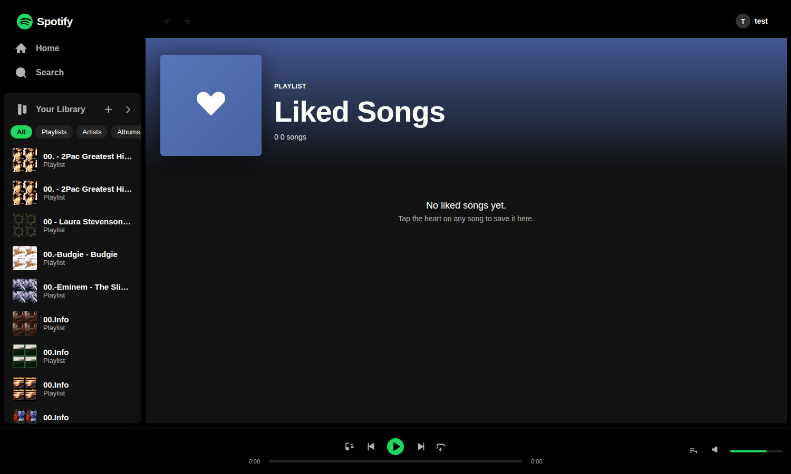
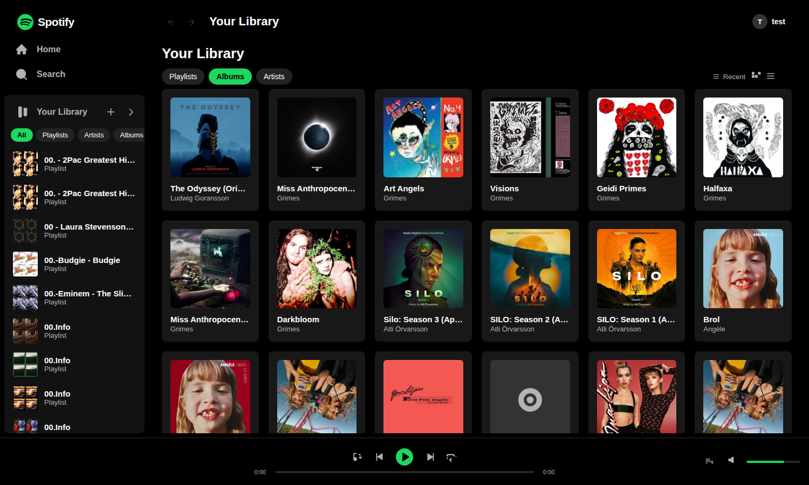
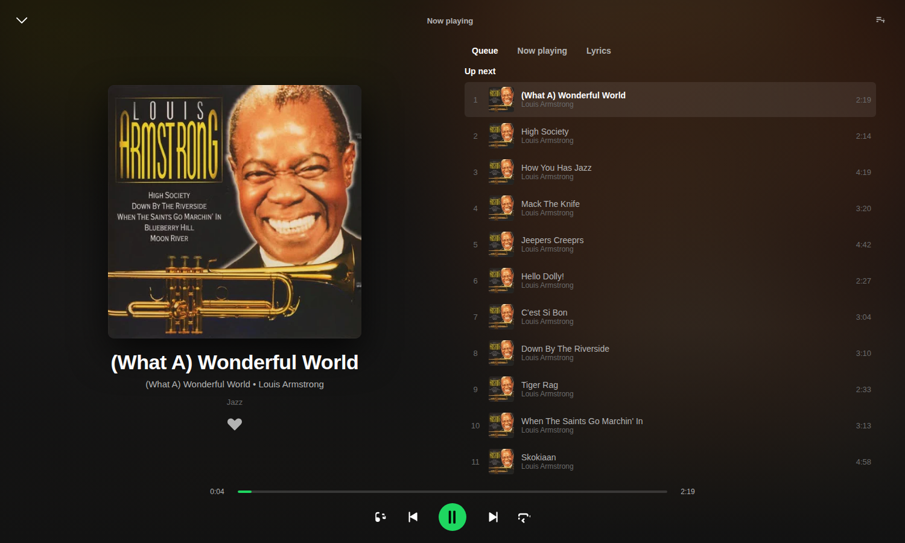

# Jelly Spotify — a Spotify-clone music streaming app for Jellyfin

A fully client-side **SvelteKit** web app that matches the Spotify desktop design 1:1
(dark theme, green `#1ed760` accents, left navigation library, card grids with hover
play buttons, bottom player bar, full-screen Now Playing view, queue drawer) and streams
audio directly from a Jellyfin server via its HTTP API (`CORS` enabled by default).

## Features
- **Auth** — log in with your Jellyfin `username` / password and server URL (defaults to `http://127.0.0.1:8096`).
- **Home** — time-of-day greeting, quick-pick tiles, Recently played (client history), Made for You, Recently added, Your artists, Liked songs.
- **Search** — realtime results grouped into Songs / Albums / Artists / Playlists, plus a "Browse all" genre grid.
- **Album / Artist / Playlist / Liked-Songs pages** with Spotify-style blurred headers, play/shuffle, favorite (heart), context menus (right-click), add-to-playlist, remove-track, edit & delete playlists.
- **Player** — play/pause, prev/next, shuffle, repeat (off/all/one), seek, volume; continues across page navigation; reports playback to Jellyfin (`/Sessions/Playing/...`).
- **Now Playing** full-screen view (Queue / Now playing / Lyrics tabs).
- **Queue drawer**, toasts, text modals (create/rename), custom in-app back/forward history, keyboard shortcuts (`Space`, `Ctrl←/→`, `m`, `s`).
- Fully responsive / resizable for desktop screens.

## Screenshots

| Home | Search | Album |
|---|---|---|
|  |  |  |

| Artist | Playlist | Liked Songs |
|---|---|---|
|  |  |  |

| Library | Now Playing |
|---|---|
|  |  |

## Run
```bash
npm install
npm run dev            # http://localhost:5173
npm run build && npm run preview   # production static build -> build/
```

## Notes
- The app talks to the Jellyfin server directly from the browser (server must have CORS
  enabled, which is the Jellyfin default).
- Auth token / server URL / audio volume / recent history are persisted in `localStorage`.
